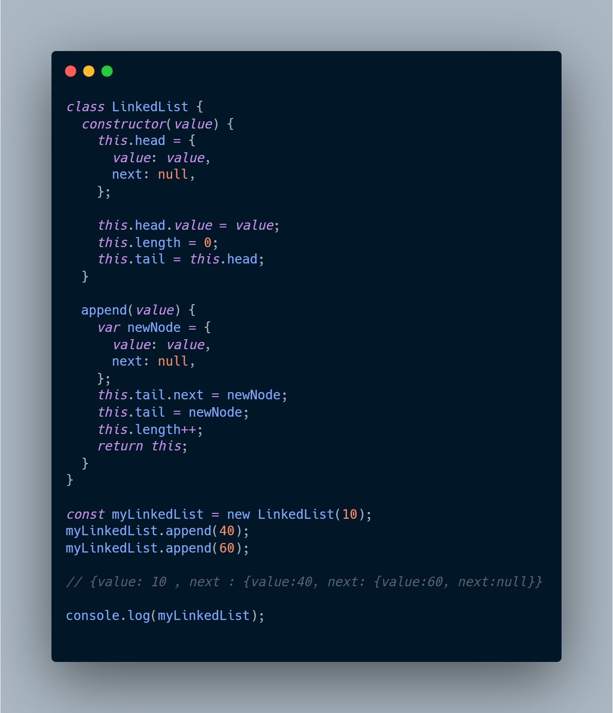

# LinkedList implementation in Js

### 1. In linked list we have node where we have data or value(as in example) and another is link or next (as in example). Where, data is the actual data we pass like int,float or any data and next is the pointer to the next data.

### 2. append is the method inside the class which helps to add new data to the instance object of that class.

### 3. output structure linked to each other be like: 10 >> 40 >> 60 >> null
