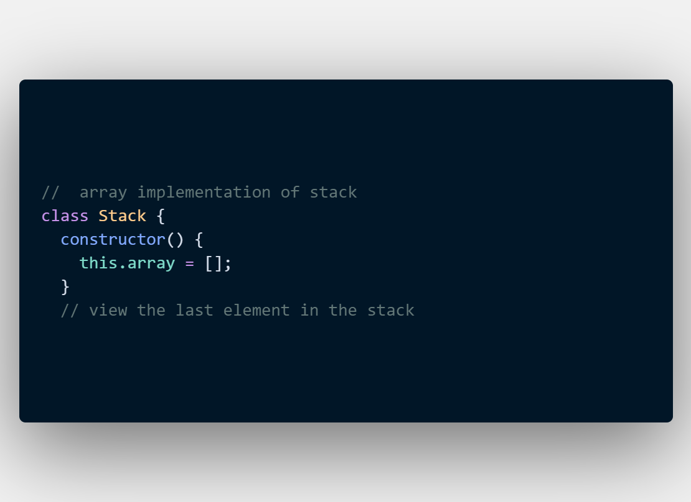
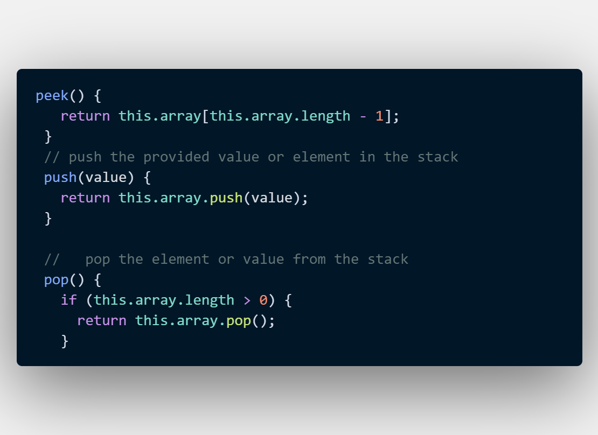
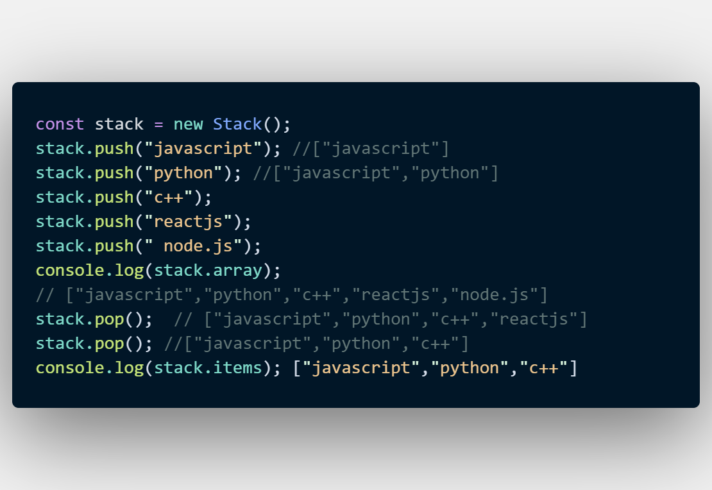

# Array implementaion of stact in Js
## 1.First define a class Stack where constructor defined inside it

## 2.Different methods like push() , pop() ,peek() , isEmpty , clear() , size() can be used, but i used only 3's of them

## 3.Here we get instances of class Stack in new const variable called stack. We passed value and added to the stack by using that method called stack.push(). Inside push we pass value like in the following example.

